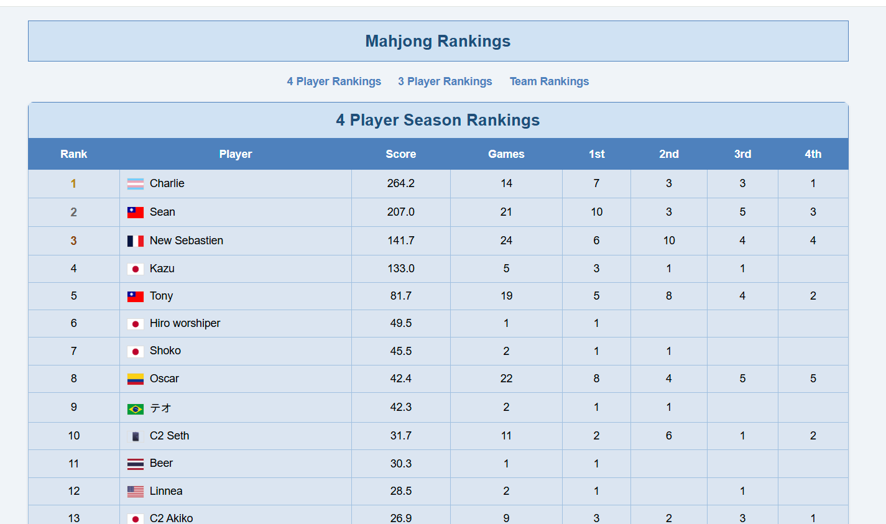

# Mahjong Tracker

A Google Sheets-based mahjong score tracking system with automated workflow for local development and web publishing.  Tested in Windows and WSL.


Do you have a group of friends or a mahjong parlor and need to track everybodies scores over the season?   If so, use this google sheet template + its App Script, it allows you to easily add games and track player stats.


BTW, this has nothing to do with the [Mahjong AI robot](https://www.youtube.com/watch?v=TIz9l8qOs68) I did btw.

Example of its automatic HTML publishing to a github page:




## Features

- **Score Tracking**: Track individual games and calculate player rankings automatically
- **Team Management**: Support for team-based competitions with rankings
- **Automated Sync**: Download and upload Google Apps Script files for local development
- **HTML Export**: Automatically generate beautiful HTML rankings pages
- **GitHub Pages Publishing**: One-click publishing to your GitHub Pages website
- **Data Export**: Download spreadsheet data in CSV, JSON, and Excel formats

## Workflow Benefits

This project simplifies working with Google Apps Script by providing:

- **Local Development**: Edit Apps Script files locally with your preferred editor
- **Version Control**: Keep your Apps Script code in Git
- **Automated Deployment**: Upload changes back to Google with a single command
- **Web Publishing**: Automatically generate and publish rankings to GitHub Pages

## Quick Start

1. **Setup OAuth credentials** (see SETUP_GUIDE.md for details)
2. **Create config.json** with your project IDs:
```json
{
  "apps_script_project_id": "your-apps-script-id",
  "spreadsheet_id": "your-spreadsheet-id"
}
```
3. **Install dependencies**: `pip install -r requirements.txt`
4. **Download Apps Script files**: `python apps_script_sync.py download`
5. **Make changes locally** and upload: `python apps_script_sync.py upload`

## Key Commands

- `python apps_script_sync.py download` - Download Apps Script files from Google
- `python apps_script_sync.py upload` - Upload local changes to Google
- `python sheets_download.py` - Download spreadsheet data (CSV/JSON/Excel)
- `python reset_auth.py` - Reset authentication if needed

## Project Structure

- `apps_script_files/` - Local copies of Google Apps Script files
- `sheet_data/` - Downloaded spreadsheet data (not really needed, but can be useful)
- `index.html` - Auto-generated rankings webpage
- `config.json` - **Required**: Contains Apps Script and Spreadsheet IDs

## Requirements

- Python 3.6+
- Google Cloud Project with Apps Script API enabled
- `config.json` file with your project IDs

See [SETUP_GUIDE.md](SETUP_GUIDE.md) for detailed setup instructions.

## License

This project is licensed under the MIT License - see the [LICENSE](LICENSE) file for details.

## AI Disclosure

This software was partially developed with the assistance of AI tools. The codebase includes contributions from AI-assisted development while maintaining human oversight and testing.


