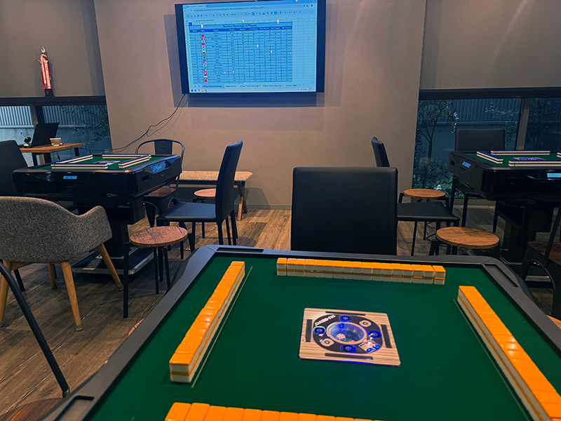

# Mahjong Tracker

A Google Sheets-based mahjong score tracking system for Japanese style Riichi Mahjong parlors or home tournaments.publishing.  Tested in Windows and WSL.

Do you have a group of friends or a mahjong parlor and need to track everybodies scores over the season?   If so, use this google sheet template + its App Script, it allows you to easily add games and track player stats.  Let's make Riichi Mahjong more popular in the west!

A template example of it can be [viewed and copied here](https://docs.google.com/spreadsheets/d/1FPFDz02pHcMTQVWbEV1s2KLiHF15_rTm2Qk-TRcw1tM).  However, this won't copy the Apps Script files, so I think you'll have to copy those from the apps_script_files dir here into it, manually (Extensions->Apps Scripts), or use the fancy harder to use scripts in this repo to copy them for you.

Note:  The permissions are very scary on this due to the auto file syncing etc, you don't have to approve them all if you aren't using the auto file syncing stuff, etc.  You do need to approves access to read/write to the sheets file when it asks as a minimum though.

If you install the scripts right, in the Sheets file you'll notice a new option: "C2 Options"

## Scoring rules and such

The Riichi Mahjong scoring is similar to MLeague but with some modifications. (no two parlours work exactly the same, ours are tweaked to be slightly more beginner friendly and fun)

The (70% done, under constructions) Official C2 Kyoto house rules: [English](media/ハウスルール（英語）.docx) [Japanese](media/ハウスルール.docx)

Come visit [C2 Kyoto](https://www.c2kyoto.com) someday and play with us!

## Features

- **Score Tracking**: Track individual games and calculate player rankings automatically
- **Team Management**: Support for team-based competitions with rankings
- **Flags and images**: Can assign country flags for each player, and images for teams
- **Nick names**: Can specify a "nick name" for players to use in the rankings, helps with privacy
- **Easy editing**: Every player, game etc is just a row in a spreadsheet, so easy to make revisions or delete games

## Optional Workflow Benefits

If you just use the sheet with its Apps Script it will work, but you can also go next level for stuff like this:

- **GitHub Pages Publishing**: One-click publishing to your GitHub Pages website from the Apps Script
- **Automated Sync**: Local python script to download and upload Google Apps Script files for faster development
- **Data Export**: Local python script that can download spreadsheet data in CSV, JSON, and Excel formats

## More screenshots

## Optional fancy scripts

To use the fancy scripts that do auto uploading and write HTML rankings to a git page automatically, see the [SETUP_GUIDE.md](SETUP_GUIDE.md) 

## License

This project is licensed under the MIT License - see the [LICENSE](LICENSE) file for details.

## AI Disclosure

This software was partially developed with the assistance of AI tools. The codebase includes contributions from AI-assisted development while maintaining human oversight and testing.

## Notes and misc

- This has nothing to do with Seth's [Mahjong AI robot](https://www.youtube.com/watch?v=TIz9l8qOs68), that's a different project.
- I just realized I hardcoded it so flag images are read from rtsoft, but meh, that's fine I guess, I have the bandwidth

## Credits

- Written by Seth A. Robinson
- House rules documents written by Akiko Robinson and Wei Yi
- Special thanks to C2 Kyoto for being force to beta test this for the last few years
